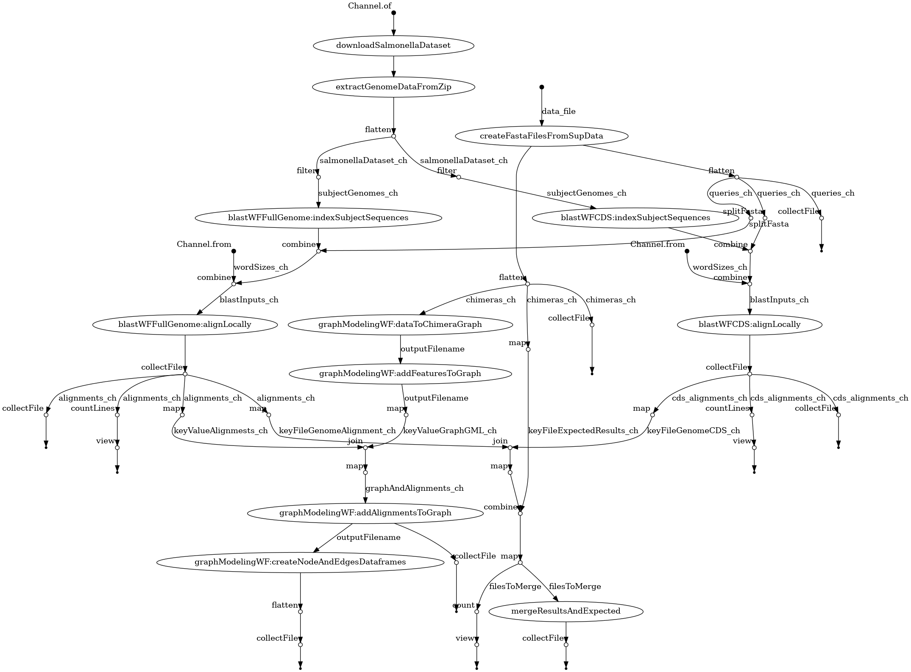

sRNAs_Interactomes
===

## About

Repository for workflows, data analysis, and everything related to sRNA interactome studies done under Marisa Nicolá and Diogo Tschoeke supervision during LNCC computer modeling course.

## dependecies

- [Nextflow](https://www.nextflow.io/): framework to run scientific workflows.

## Workflow

<div class="center">
   
</dib>

### Data


Liu, et al. [1] has made his interactome dataset abailable on [Geo Database](https://www.ncbi.nlm.nih.gov/geo/query/acc.cgi?acc=GSE234792) we are going to experiment on this dataset. We will use [nf-core/fetchngs](https://nf-co.re/fetchngs/1.11.0) workflow to fetch such data. [fetch_data.sh](./fetch_data.sh) uses this workflow to download data from GEO database with following workflow call:

#### Raw Data

```bash
nextflow run -resume nf-core/fetchngs \
   --input ./data/datasets_ids.csv \
   --outdir ./data
```

#### Suplementaru Data

https://www.nature.com/articles/s41467-023-43632-1#additional-information


## References

1. Liu, F., Chen, Z., Zhang, S., Wu, K., Bei, C., Wang, C., & Chao, Y. (2023). In vivo RNA interactome profiling reveals 3’UTR-processed small RNA targeting a central regulatory hub. Nature Communications, 14(1), 8106. https://doi.org/10.1038/s41467-023-43632-1