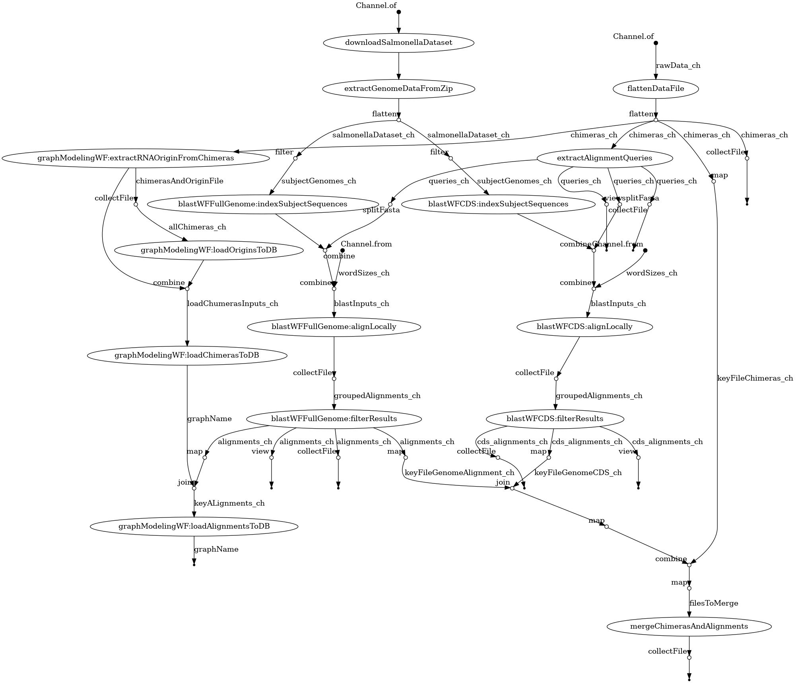

sRNAs_Interactomes
===

## About

Repository for workflows, data analysis, and everything related to sRNA interactome studies done under Marisa Nicolá and Diogo Tschoeke supervision during LNCC computer modeling course.

## dependencies

- [Nextflow](https://www.nextflow.io/): framework to run scientific workflows.
- [Docker](https://www.docker.com/): container framework
 
## Running

The following command should run the pipeline

```bash
nextflow run -resume main.nf -with-report output/report.html -with-timeline output/timeline.html -with-dag docs/dag.png
```

### Input Data

Liu, et al. [1] has made his interactome dataset available on [Geo Database](https://www.ncbi.nlm.nih.gov/geo/query/acc.cgi?acc=GSE234792) we are going to experiment on this dataset. We will use [nf-core/fetchngs](https://nf-co.re/fetchngs/1.11.0) workflow to fetch such data. [fetch_data.sh](./fetch_data.sh) uses this workflow to download data from GEO database with following workflow call:

This pipeline processes the [supplementary data 5](https://www.nature.com/articles/s41467-023-43632-1#additional-information) which contains some interactions between sRNA and mRNA as described on source. The first spreadsheet in [data file](./data/Liu_sup5_data.xlsx) - committed in this repo for convenience -  contains metadata, all other datasets corresponding to experiments as described in the paper.

| Field                          | Description                                                                                                                             |
|--------------------------------|-----------------------------------------------------------------------------------------------------------------------------------------|
| RNA1 name                      | Common name of RNA1 mapped to the genomic                                                                                                |
| RNA2 name                      | Common name of RNA2 mapped to the genomic                                                                                                |
| RNA1 Strand                    | The strand RNA1 was mapped to                                                                                                            |
| RNA1 from                      | Position of the first nucleotide of the most 5' chimera mapped to RNA1                                                                   |
| RNA1 to                        | Position of the first nucleotide of the most 3' chimera mapped to RNA1                                                                   |
| RNA1 ligation from             | Position of the last nucleotide of the most 5' chimera mapped to RNA1                                                                    |
| RNA1 ligation to               | Position of the last nucleotide of the most 3' chimera mapped to RNA1                                                                    |
| RNA2 Strand                    | The strand RNA2 was mapped to                                                                                                            |
| RNA2 from                      | Position of the last nucleotide of the most 5' chimera mapped to RNA2                                                                    |
| RNA2 to                        | Position of the last nucleotide of the most 3' chimera mapped to RNA2                                                                    |
| RNA2 ligation from             | Position of the first nucleotide of the most 5' chimera mapped to RNA2                                                                   |
| RNA2 ligation to               | Position of the first nucleotide of the most 3' chimera mapped to RNA2                                                                   |
| Number of interactions         | Number of chimeras supporting the interaction                                                                                            |
| Odds Ratio                     | (K/L)/(M/N), where K= Number of chimeric fragments of RNA1-RNA2, L=number of other fragments involving RNA2, M=number of other fragments involving RNA1, N=number of all other fragments (that do not involve RNA1 and RNA2) |
| One-sided Fisher's exact test p-value | p-value for observing at least this number of chimeric fragments given their background frequencies on Hfq. The Odds Ratio provides the effect size of the test |
| RNA1 type                      | The genomic annotation of RNA1                                                                                                           |
| RNA2 type                      | The genomic annotation of RNA2                                                                                                           |
| RNA1 seq                       | RNA1 start was taken from the coordinate termed "RNA1 from" and RNA1 end was taken the coordinate termed "RNA1 ligation to". If "RNA1 ligation to" was not identified, RNA1 end was taken 20 nucleotides downstream the coordinate termed "RNA1 to" |
| RNA2 seq                       | RNA2 start was taken the coordinate termed "RNA2 ligation from" and the end was taken at coordinate of "RNA2 to". If "RNA2 ligation from" was not identified, RNA2 start was taken 20 nucleotides upstream the coordinate termed "RNA2 from" |

#### Raw Data

The raw data from which supplementary data was derived can be fetched from NCBI using [fetchngs Nextflow pipeline](https://nf-co.re/fetchngs/)

```bash
nextflow run -resume nf-core/fetchngs \
   --input ./data/datasets_ids.csv \
   --outdir ./data
```

The full pipeline from those read to supplementary data is not yet public.

## Workflow

The workflow implemented on [main.nf](./main.nf) will:

| Input Parameter                  | Description                                                                                                                                                                                                                                                                                                                                 | Default Value                                                                 |
|----------------------------------|---------------------------------------------------------------------------------------------------------------------------------------------------------------------------------------------------------------------------------------------------------------------------------------------------------------------------------------------|-------------------------------------------------------------------------------|
| output_dir                       | Path to a directory where outputs will be copied on execution end.                                                                                                                                                                                                                                                                          | "output"                                                                      |
| data_file                        | Path to a directory where supplementary data input is.                                                                                                                                                                                                                                                                                       | "data/Liu_sup5_data.xlsx"                                                     |
| cache_dir                        | Path to a directory where intermediate results will be cached.                                                                                                                                                                                                                                                                                | "data"                                                                        |
| queries_files_chunk_sizes        | Query files will be split so to contain at most this number of queries to enhance parallelism.                                                                                                                                                                                                                                              | 10                                                                            |
| salmonella_ref_genome_ftp_url    | FTP URL for Salmonella Enteric strand genomic data used in study.                                                                                                                                                                                                                                                                            | "https://ftp.ncbi.nlm.nih.gov/genomes/all/GCF/000/210/855/GCF_000210855.2_ASM21085v2/GCF_000210855.2_ASM21085v2_genomic.fna.gz" |
| salmonella_features_table_url    | FTP URL for Salmonella Enteric strand feature table data used in study.                                                                                                                                                                                                                                                                      | "https://ftp.ncbi.nlm.nih.gov/genomes/all/GCF/000/210/855/GCF_000210855.2_ASM21085v2/GCF_000210855.2_ASM21085v2_feature_table.txt.gz" |

**Output**

| Output Type       | Description                                                                                                                                                                                                                                                             |
|-------------------|-------------------------------------------------------------------------------------------------------------------------------------------------------------------------------------------------------------------------------------------------------------------------|
| Primary Outputs   | - Alignment files: For each experiment, for each parameterized value for *word_size*, the alignment result for each query extracted from the supplementary data input file.                                                                                             |
| Secondary Outputs | - Report and Timeline: HTML files outputted by Nextflow runner containing the last run profiler information (memory usage, CPU usage, etc.) - if *-with-report* and *-with-timeline* flags are set. <br> - Queries files: FASTA files with sequences extracted from the supplementary data file input using a [Python script](./src/sup_data_to_fasta.py). These files are passed to BLAST as input. |

As described in the supplementary data, the reference genome used is [Salmonella enterica subsp. enterica serovar Typhimurium str. SL1344](https://www.ncbi.nlm.nih.gov/datasets/genome/GCF_000210855.2/).

<div class="center">
   
</dib>

## References

1. Liu, F., Chen, Z., Zhang, S., Wu, K., Bei, C., Wang, C., & Chao, Y. (2023). In vivo RNA interactome profiling reveals 3’UTR-processed small RNA targeting a central regulatory hub. Nature Communications, 14(1), 8106. https://doi.org/10.1038/s41467-023-43632-1